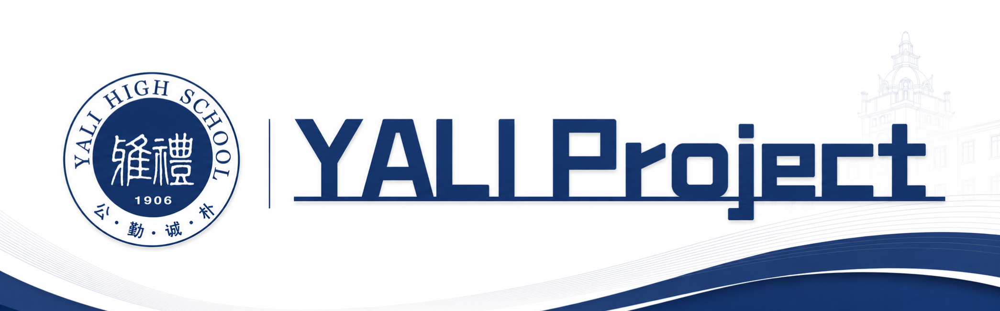
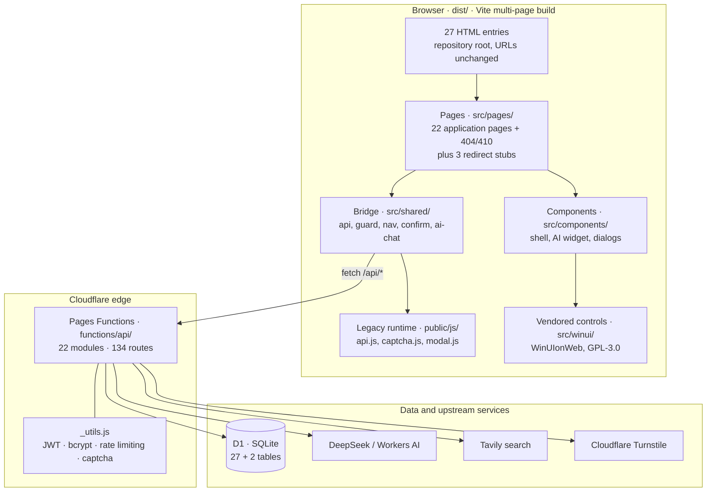
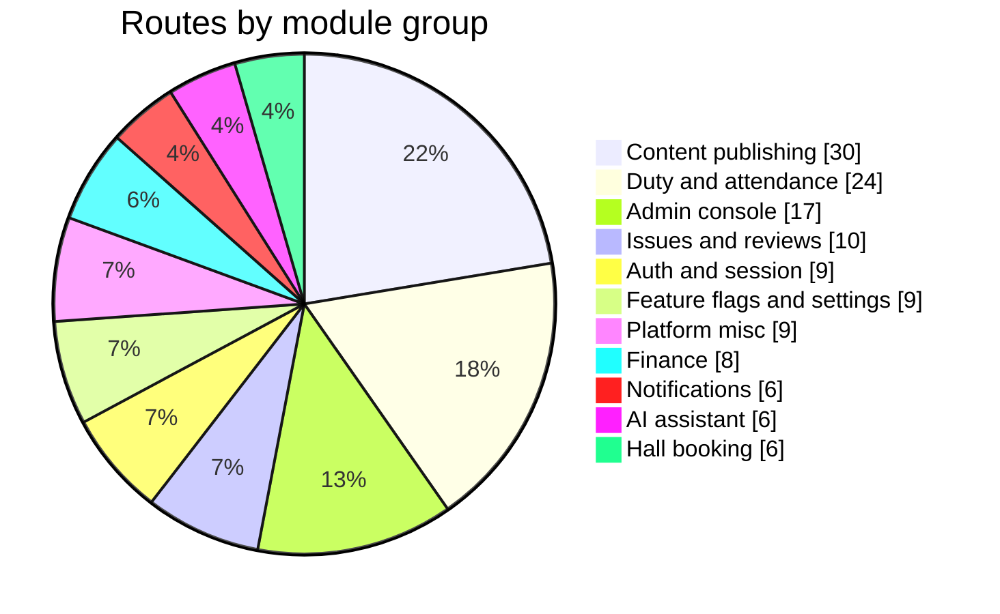
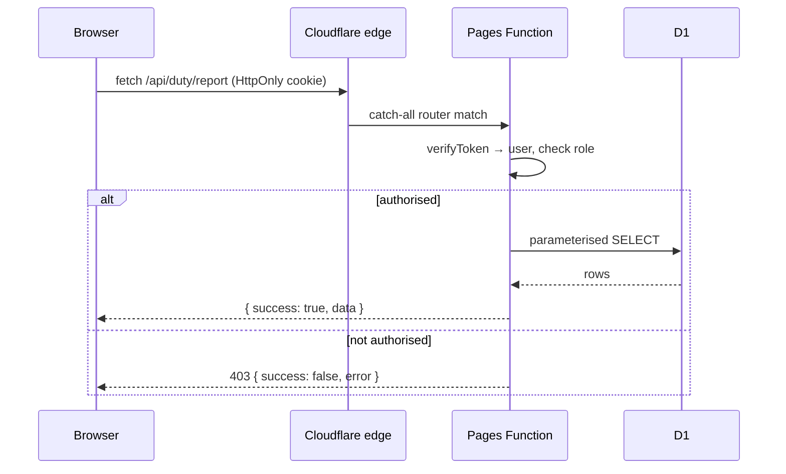

<div align="center">



# Yali Youth League · One-Stop Platform

**English** · [简体中文](README.zh-CN.md)

[]()
[](LICENSE)
[]()
[]()
[]()
[]()
[]()

A one-stop service and administration platform for the Youth League Committee of
Yali High School, Changsha — issue reporting, announcements, activity feed, polling,
finance, hall booking, duty attendance, membership management and an AI assistant,
running entirely on the Cloudflare edge.

</div>

> [!NOTE]
> This is the official platform of the Yali High School Youth League Committee. :)

---

## Table of contents

- [Overview](#overview)
- [Feature modules](#feature-modules)
- [Architecture](#architecture)
- [Tech stack](#tech-stack)
- [Repository layout](#repository-layout)
- [Data model](#data-model)
- [Roles and permissions](#roles-and-permissions)
- [API surface](#api-surface)
- [Quality gates](#quality-gates)
- [Getting started](#getting-started)
- [Environment variables](#environment-variables)
- [Scripts](#scripts)
- [Deployment](#deployment)
- [Design system](#design-system)
- [Engineering conventions](#engineering-conventions)
- [Limitations and roadmap](#limitations-and-roadmap)
- [Acknowledgements](#acknowledgements)
- [License](#license)

---

## Overview

The platform replaces the paper forms and group-chat workflows of a Youth League committee
office: students report broken facilities, the office publishes announcements, events recruit
volunteers, the school votes on proposals, the thousand-seat hall is booked by timeslot, and
duty officers sign in and out for attendance scoring.

**Version 4.0 was a complete front-end rewrite.** The original site was hand-written
HTML/CSS/vanilla-JS with no build step. It is now a Vite multi-page application whose UI is
built on [WinUIonWeb](https://github.com/Furry-Xiyi/WinUIonWeb) — a Vue 3 port of the WinUI 3
/ Fluent Design control set — while the backend (Cloudflare Pages Functions + D1) and every
public URL stayed unchanged.

| | |
|---|---|
| **Pages** | 27 HTML entries at the repository root — 22 application pages, plus 404/410 and 3 redirect stubs |
| **Backend** | 22 modules · **134 routes** on Cloudflare Pages Functions |
| **Database** | Cloudflare D1 (SQLite) · 27 tables declared + 2 created on demand |
| **Frontend** | Vue 3.5 SFC + Vite 7 — ~12.4k lines of page code on a 43.9k-line vendored control library |
| **Achievements** | 35 hidden achievements, detected client-side and verified server-side |
| **Quality** | 6 build-time guards · 24-page render regression · 303 interaction assertions |

<details>
<summary><b>What changed in 4.0</b></summary>

<br>

- Every application page now shares one Fluent shell: an adaptive `NavigationView` that becomes an icon
  rail on tablets and an overlay drawer on phones.
- The design tokens moved from a single Material 3 stylesheet to the WinUI theme contract,
  bridged one-way from the existing `--md-*` tokens so no second design system was introduced.
- Access guards, the site-wide dialog system, cookie consent and the class-name prompt were
  rebuilt as typed modules instead of scattered globals.
- Six static guards and a two-layer browser test suite were added, because the rewrite's
  dominant failure mode was *silent* — pages rendered fine while features did nothing.

</details>

---

## Feature modules

| Module | What it does |
|---|---|
| **Issue reporting** | Categorised facility reports with photo evidence, status flow (pending → in progress → done), administrator assignment, and a comment thread shared by reporter and handler |
| **Announcements** | Rich text with inline images, an approval workflow, categories and threaded comments |
| **Activity feed** | Reverse-chronological timeline, image posts, cursor pagination, comments |
| **Polling** | Single-choice, multiple-choice and free-text questions in one ballot, image options, anonymous mode, CSV export, anti-abuse captcha |
| **Finance** | Income/expense ledger, monthly roll-up charts, tag filters, reimbursement workflow, department-level isolation |
| **Hall booking** | Timeline drag-selection, automatic conflict detection, reviewer approval with a Gantt view of collisions |
| **Duty attendance** | Two officers per slot, sign-in/sign-out, automatic scoring by duration, 60-day schedule generation, automatic absence marking, CSV exports and a weekly report |
| **Review queue** | Image and announcement moderation, with rejection reasons surfaced back to the submitter |
| **Membership** | Six-tier roles, registration approval, three-stage bulk import with concurrent bcrypt hashing, password resets |
| **Notification centre** | Per-user notifications with unread badges, feature-gated behind an invitation system |
| **AI assistant** | Streaming chat over SSE with tool calling — queries the site database, searches the web, and remembers long-term preferences |
| **Achievements** | 35 hidden achievements spanning exploration, interaction, data accumulation and easter eggs |
| **Personalisation** | Light/dark/system theme, accent colours, font scaling and an optional particle/animation layer |
| **Feedback** | User suggestions with an administrator inbox |
| **Site operations** | Maintenance overlay, feature flags, storage statistics, owner-only bulk reset |

### Duty attendance, in more detail

The most operationally complex module, and a good illustration of the platform's depth:

- **Scheduling** — generates 60 working days ahead, skipping weekends, rotating two officers
  per day and continuing the rotation from the last existing row rather than restarting it.
- **Sign-in enforcement** — the server refuses sign-in before the configured slot start time,
  computed in Beijing time regardless of the runtime's UTC clock.
- **Scoring** — sign-out computes elapsed time; anything under two minutes scores `-0.5`.
  A period-end sweep marks non-attenders absent and writes `-1`, de-duplicated against
  existing score rows so repeated requests cannot charge a student twice.
- **Manual override** — administrators can add, modify or cancel score records; cancellation
  requires re-authenticating with an administrator password and rolls back the attendance row.
- **Weekly report** — a single endpoint feeds both the on-screen tables and three CSV exports
  (weekly roster, weekly deductions, all-time deductions), with an optional AI-written summary.

---

## Architecture



**Two deliberate architectural choices**

1. **The legacy layer was kept, not rewritten.** `public/js/*.js` (~10k lines) still owns the
   network client, the icon set, the self-hosted captcha widget, the achievement engine and
   the personalisation store. `src/shared/api.ts` wraps those globals in typed functions. This
   was the only realistic way to migrate the site's 27 page entries without re-implementing and re-testing 10k
   lines of behaviour that was already proven in production.

2. **One-way theme bridge.** The site already had a complete Material 3 token set under
   `--md-*`. Rather than introduce a second design system, a small bridge in `src/theme/`
   mirrors the site's `.dark` class onto the `theme-dark` / `theme-light` classes the Fluent
   controls expect, and pins the icon font. No token is duplicated.

---

## Tech stack

| Layer | Choice | Notes |
|---|---|---|
| Build | **Vite 7** | Multi-page: every root `*.html` is an entry, hashed assets under `assets/` |
| UI framework | **Vue 3.5** SFC | `<script setup>` with TypeScript |
| Component library | **WinUIonWeb** | Vendored under `src/winui/` (GPL-3.0), ~100 controls; the app registry is trimmed to the 25 tags actually used |
| Design language | **WinUI 3 / Fluent** | Adaptive NavigationView, ContentDialog, InfoBadge, Expander … |
| Runtime | **Cloudflare Pages Functions** | Workers runtime, catch-all `[[path]].js` router |
| Database | **Cloudflare D1** | SQLite, parameterised queries only |
| Auth | **jose** JWT in an HttpOnly cookie | `token_version` invalidates sessions on password change |
| Passwords | **bcryptjs**, 10 rounds | Concurrent hashing during bulk import |
| Captcha | **Self-hosted SVG captcha** | HMAC-signed token, 5-minute TTL, confusion-free alphabet |
| Bot protection | **Cloudflare Turnstile** | Optional; the self-hosted captcha is always available |
| AI | **OpenAI-compatible API or Workers AI** | Defaults to DeepSeek; streaming SSE with tool calling |

---

## Repository layout

```
.
├── *.html                       27 page entries (the URL surface), generated shells
├── functions/api/               Cloudflare Pages Functions
│   ├── [[path]].js              catch-all router — the route table lives here
│   ├── _utils.js                JWT, bcrypt, rate limiting, captcha, notifications
│   └── <22 modules>             auth, admin, duty, ai, polls, finance, halls …
├── src/
│   ├── winui/                   vendored WinUIonWeb control library (GPL-3.0)
│   ├── pages/<page>/            one folder per page: App.vue + main.ts
│   ├── components/              site-specific shell and dialogs
│   ├── shared/                  api, guard, nav, confirm, theme, icons, ai-chat
│   └── theme/                   Fluent ⇄ Material token bridge and page styles
├── public/
│   ├── js/                      legacy runtime still in service (~10k lines)
│   ├── css/material/            design tokens and legacy component styles
│   ├── fonts/ icon/ images/     subset icon font, emblems
│   ├── version.js               APP_VERSION / APP_DEPLOYED
│   └── _headers                 CSP, HSTS and cache policy
├── scripts/                     18 build, guard and test scripts
├── schema.sql                   D1 schema (27 tables)
├── vite.config.ts               multi-page config, dev-build define
└── wrangler.toml                Pages + D1 binding
```

---

## Data model

27 tables are declared in `schema.sql`; the AI module creates two more on first use.

| Domain | Tables |
|---|---|
| Identity | `users`, `notifications`, `features`, `user_feature_responses` |
| Content | `announcements`, `announcement_images`, `comments`, `chat_messages`, `feed_comments` |
| Service | `issues`, `reviews`, `activities`, `activity_volunteers`, `hall_bookings` |
| Polling | `polls`, `poll_questions`, `poll_responses`, `poll_answers` |
| Finance | `finance` |
| Duty | `duty_staff`, `duty_schedule`, `duty_attendance`, `duty_score_record`, `duty_period_config` |
| Operations | `settings`, `feedback` |
| AI (on demand) | `ai_messages`, `ai_memories` |

> [!IMPORTANT]
> Timestamps written by SQLite (`datetime('now')`) are **UTC**, while the site displays
> Beijing time. Duty schedule dates and finance business dates are stored as local date
> strings instead. Mixing the two is the single most common source of off-by-eight-hours bugs.

---

## Roles and permissions

Six tiers, strictly ordered. Every page that needs authorisation declares one guard, and an
insufficient role is redirected to the 404 page rather than back to the home page — the 404
page is intentional camouflage, so an unauthorised visitor learns nothing about what exists.

| Role | Weight | Can reach |
|---|---|---|
| `public` | 1 | Duty sign-in panel only |
| `member` | 2 | Finance, the AI assistant, and general member features |
| `officer` | 3 | Officer-level features |
| `teacher` | 4 | Administration and duty management |
| `admin` | 5 | Full admin console, moderation, membership |
| `owner` | 6 | Site settings, bulk reset, destructive maintenance |

Beyond page-level guards, the API enforces its own checks per handler — duty reports and score
exports, for instance, are administrator-only even though the duty sign-in panel is public.

---

## API surface

134 routes, grouped by the module that serves them.



<details>
<summary><b>Endpoint reference by module</b></summary>

<br>

| Module | Routes | Representative endpoints |
|---|---|---|
| Content | 30 | `/api/announcements`, `/api/polls/:id/vote`, `/api/activities/:id/volunteer`, `/api/chat/messages`, `/api/comments` |
| Duty and attendance | 24 | `/api/duty/schedule/generate`, `/api/duty/attendance/sign-in`, `/api/duty/report`, `/api/duty/scores/export` |
| Admin console | 17 | `/api/admin/members`, `/api/admin/users/batch-import`, `/api/admin/settings`, `/api/admin/clear-all` |
| Issues and reviews | 10 | `/api/issues`, `/api/issues/:id/status`, `/api/reviews/:id/review` |
| Auth | 9 | `/api/auth/login`, `/api/auth/me`, `/api/auth/logout`, `/api/auth/change-password` |
| Feature flags | 8 | `/api/features/enabled`, `/api/features/:key/respond` |
| Finance | 8 | `/api/finance`, `/api/finance/:id/reimburse`, `/api/finance/images` |
| Notifications | 6 | `/api/messages`, `/api/messages/unread-count`, `/api/messages/:id/read` |
| AI assistant | 6 | `/api/ai/chat`, `/api/ai/status`, `/api/ai/memories` |
| Hall booking | 6 | `/api/hall/bookings`, `/api/hall/bookings/pending`, `/api/hall/bookings/:id/review` |
| Platform misc | 9 | `/api/captcha/generate`, `/api/banner`, `/api/settings`, `/api/sync` |

</details>

<details>
<summary><b>How a request flows</b></summary>

<br>



</details>

---

## Quality gates

The 4.0 rewrite made "the page renders but nothing works" the dominant failure mode: a tab
that never switches, a captcha that silently returns an empty token, a guard that lets
everyone through — all invisible to a screenshot. The project therefore treats verification
as a first-class feature.

**Six guards run before every production build** (`npm run build` fails if any of them trip):

| Guard | Prevents |
|---|---|
| `check-glyphs` | Icon codepoints missing from the subset font — they render as tofu boxes, and only on devices without the system fallback |
| `icon-refs` | Dangling icon references in markup |
| `check-components` | A control used in a template but never registered — Vue silently renders it as an unknown tag |
| `check-classnames` | The `ad-` class prefix, which content blockers hide (reproducibly — but only in some browser profiles) |
| `check-identifiers` | Calls to identifiers that were never imported — a `500` in Workers, or a silently swallowed failure in the browser |
| `check-dialogs` | Duplicate "Cancel" buttons — one in the dialog body, one in the footer |

**Then two browser layers:**

| Command | Coverage |
|---|---|
| `npm run regress` | 24 pages rendered in headless Chromium: sentinel present, zero JS errors, **zero console warnings** |
| `npm run smoke` | 36 groups / **303 assertions** driving real interactions — tab switching, request bodies, captcha lifecycle, guard redirects, CSV export contents, dialog behaviour |

> [!TIP]
> The suite is designed to be **broken on purpose** at least once. A check that has never
> failed is not evidence of anything. Every guard here has been observed going red on a real
> defect before it was trusted.

<details>
<summary><b>What the interaction suite actually asserts</b></summary>

<br>

- Login page: both captchas rendered, and a submit issues exactly one request
- Admin console: nine tabs switch, and the tab bar scrolls horizontally on narrow screens
- Duty management: 14-day page stride, manual-schedule and bulk-cancellation request bodies,
  weekly report tables, CSV export contents and byte-order mark, bulk staff import payload
- Polls: question-type switching, image rendering, captcha mounted inside a dialog
- Guards: an unauthorised visitor is redirected to `/404.html?from=…`, and an administrator
  is *not* — a guard that blocks everyone would otherwise pass
- Logout: the cookie is cleared, and navigation waits for the response
- AI assistant: streaming answer, tool chips, reasoning toggle, memory management, and the
  graceful "not configured" path
- Layout: page width follows the viewport, the sidebar collapses to an icon rail at 800px,
  and no image renders as a broken placeholder

</details>

---

## Getting started

### Prerequisites

- **Node.js `^20.19.0 || >=22.12.0`** (required by Vite 7)
- A Cloudflare account (for D1 access and deployment)
- Git

### Local development

```bash
# 1. Clone
git clone https://github.com/ChidcGithub/Yali-Tongban-Platform.git
cd Yali-Tongban-Platform

# 2. Install
npm install

# 3. Authenticate with Cloudflare (needed to reach D1)
npx wrangler login

# 4. Front-end dev server (hot reload)
npm run dev

# 5. Or run the full stack — Functions plus a local D1 — against the built output
npm run build
npm run dev:pages
```

> [!NOTE]
> `npm run dev` serves the Vue pages only. Requests to `/api/*` need `npm run dev:pages`,
> which runs the real Functions runtime against a local D1.

### Initialise the database

```bash
npm run db:init            # apply schema.sql to the D1 database
```

In production the schema applies itself: every request runs an idempotent `initDB()` that
creates missing tables before the router dispatches.

---

## Environment variables

Configure these in the Cloudflare dashboard under **Pages → Settings → Environment
variables**. Values are snapshotted at deploy time, so **a new or changed variable requires a
fresh deployment** of that environment.

| Variable | Required | Purpose |
|---|---|---|
| `JWT_SECRET` | **Yes** | Signing key for session tokens; treat a rotation as a global logout |
| `CAPTCHA_SECRET` | Recommended | HMAC key for the self-hosted SVG captcha |
| `TURNSTILE_SECRET` | Optional | Server-side verification for Cloudflare Turnstile |
| `AI_API_KEY` | Optional | OpenAI-compatible key; enables the AI assistant |
| `AI_BASE_URL` | Optional | Upstream base URL (defaults to the DeepSeek endpoint) |
| `AI_MODEL` | Optional | Model name (defaults to a `deepseek-flash`-class model) |
| `TAVILY_API_KEY` | Optional | Enables the assistant's web-search tool |
| `CAPTCHA_BYPASS`, `TURNSTILE_BYPASS` | Dev only | Skip captcha verification outside production |

Without an AI key the assistant reports itself as unconfigured (HTTP 503) and the UI shows
setup guidance rather than failing silently. The `AI` binding may be used instead of
`AI_API_KEY` to run on Cloudflare Workers AI with no third-party key.

> [!WARNING]
> Never commit secrets. `wrangler.toml` references bindings only; real values live in the
> Cloudflare dashboard.

---

## Scripts

| Command | What it does |
|---|---|
| `npm run dev` | Vite dev server with hot reload |
| `npm run build` | Six guards, then a production build into `dist/` |
| `npm run build:dev` | Development-flavoured build into `dist-dev/` (keeps Vue prop validation) |
| `npm run dev:pages` | Run the real Functions runtime locally with `wrangler pages dev` |
| `npm run preview` | Preview the built output |
| `npm run db:init` | Apply `schema.sql` to the D1 database |
| `npm run regress` | Render regression over 24 pages |
| `npm run regress:dev` | Same, against `dist-dev` |
| `npm run smoke` | Interaction suite (36 groups / 303 assertions) |
| `npm run smoke:dev` | Same, against `dist-dev` |
| `npm run gen:page` | Regenerate page shells for all 27 entries |
| `npm run verify` | Render a single page against a stubbed backend |
| `npm run subset:icons` | Re-subset the icon font after adding a glyph |
| `npm run check:icons` | Render-level icon audit |

Individual guards: `check:glyphs`, `check:components`, `check:classnames`,
`check:identifiers`, `check:dialogs`.

> [!IMPORTANT]
> `regress:dev` and `smoke:dev` read `dist-dev/`, which is **not** rebuilt automatically. Run
> `npm run build:dev` first, or you will be verifying the previous build.

---

## Deployment

```bash
# Preview branch
npm run build
npx wrangler pages deploy dist/ --project-name=yali-tongban --branch=winui-preview

# Production
npm run build
npx wrangler pages deploy dist/ --project-name=yali-tongban --branch=main
```

> [!CAUTION]
> Always pass `--branch` explicitly. Omitting it deploys straight to the production branch.

Production: `https://yali-tongban.pages.dev`

**Things worth knowing before you deploy**

- Cloudflare Pages **308-redirects `/page.html` to `/page`**, so code that inspects
  `location.pathname` must not expect the `.html` suffix.
- Environment variables are scoped per environment (production vs. preview) and snapshotted
  at deploy time.
- Deployment occasionally fails with `Failed to publish your Function: unknown internal
  error`. Re-running the same command succeeds.
- Preview and production deployments share one D1 database, so never use live writes as a
  test.

---

## Design system

The interface is Fluent-styled while still wearing the site's own palette.

- **Tokens** — the existing Material 3 token set (`--md-*`, a deep-blue "Yali" scheme) remains
  the single source of truth. A small bridge in `src/theme/` mirrors the site's theme class
  onto the Fluent control contract and pins the icon font.
- **Icon font** — a Segoe icon font is subset per build to the codepoints actually used
  (453 KB → ~21 KB). Adding an icon requires re-running the subsetting script; a build guard
  fails if a glyph is missing.
- **Responsive** — `NavigationView` switches from an expanded sidebar (≥1008px) to an icon
  rail (641–1007px) to an overlay drawer (<641px). The site's own sidebar-footer content is
  hand-styled for the icon-rail state, because the control library cannot know about it.
- **Motion** — transitions are short and functional; the optional "super graphic" particle
  layer is user-opted-in.

---

## Engineering conventions

A few rules are enforced by build guards rather than documentation, because in this codebase
each of them has caused a real, hard-to-see bug:

| Rule | Why |
|---|---|
| No `window.confirm` / `prompt` / `alert` | Unstyled, unlocalised, and they block the page. Use the shared dialog module |
| Dialog action buttons live in the body, never alongside a footer close button | Otherwise "Cancel" appears twice |
| Unauthorised access goes to `/404.html`, not the home page | The 404 page is deliberate camouflage |
| Logout must call the API and await it | The session cookie is HttpOnly; clearing `localStorage` is a fake logout |
| No `ad-` class prefix | Content blockers hide those elements |
| Every new icon must be re-subsetted | Otherwise it renders as a tofu box |
| Date strings from SQLite are UTC | Compare with an explicit offset |

---

## Limitations and roadmap

**Known constraints**

- **Images are stored as base64 in D1** rather than object storage — a deliberate choice to
  avoid requiring a payment method. Mitigated by a `has_image` flag, batched image endpoints,
  two-phase rendering and placeholder shimmer.
- **The legacy `public/js` layer is still in service.** Retiring it means re-implementing the
  network client, achievement engine and personalisation store; the typed bridge makes that
  incremental rather than all-or-nothing.
- **`src/winui/` is vendored**, not a dependency. Updating it is a manual re-vendor; the
  upstream commit is recorded in `src/winui/UPSTREAM_COMMIT.txt`.
- **No CI pipeline yet.** Guards and tests run locally and before deployment.

**Roadmap**

- Port the remaining legacy modules into typed code and retire `public/js`.
- Wire the guard and test suites into a CI workflow.
- Optional: move image storage to R2 once billing is acceptable.

---

## Acknowledgements

This project stands on other people's work. Full attributions, including each library's source
and author, are listed in-app at `/thanks`.

Key dependencies: [Vue 3](https://github.com/vuejs/core),
[Vite](https://github.com/vitejs/vite), [WinUIonWeb](https://github.com/Furry-Xiyi/WinUIonWeb)
(the Fluent control library, GPL-3.0), [jose](https://github.com/panva/jose),
[bcrypt.js](https://github.com/dcodeIO/bcrypt.js), and
[Cloudflare Workers / D1](https://developers.cloudflare.com/).

---

## License

[GNU Affero General Public License v3.0](LICENSE) — see `LICENSE` for the full text.

The vendored control library under `src/winui/` is licensed under **GPL-3.0**; its licence text
ships alongside the source at `src/winui/LICENSE-GPL-3.0.txt`.
