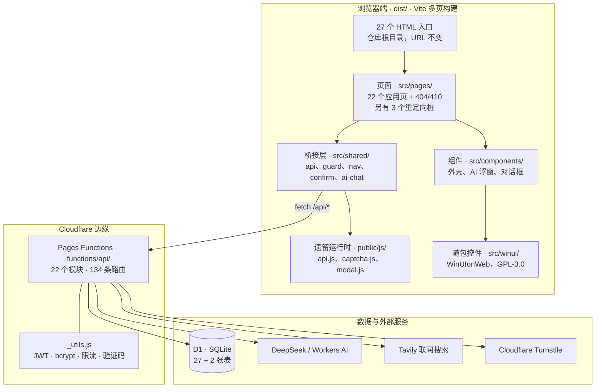
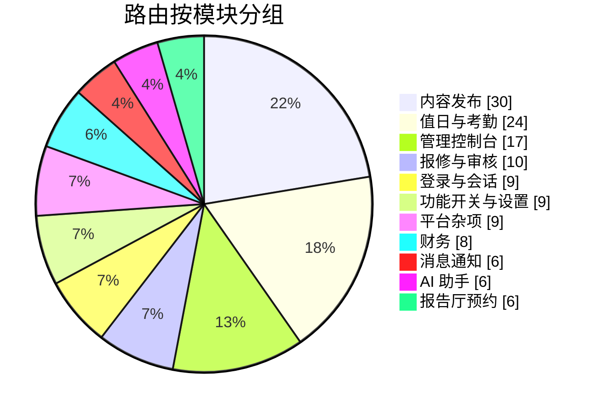
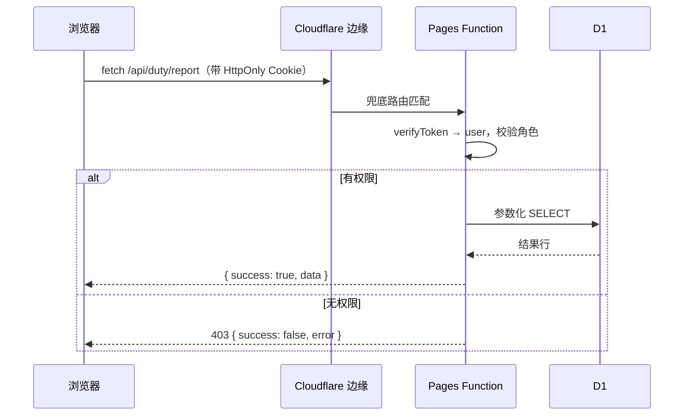

<div align="center">


# 雅礼团委 · 通办

[English](README.md) · **简体中文**

[]()
[](LICENSE)
[]()
[]()
[]()
[]()
[]()

**长沙市雅礼中学团委官方平台** —— 一站式线上办事与服务系统：
报修、公告、动态、投票、财务、报告厅预约、值日考勤、成员管理与 AI 助手，
全部运行在 Cloudflare 边缘网络上。

</div>

> [!NOTE]
> 此为雅礼中学团委官方平台。 :)

---

## 目录

- [项目概览](#项目概览)
- [功能模块](#功能模块)
- [技术架构](#技术架构)
- [技术选型](#技术选型)
- [仓库结构](#仓库结构)
- [数据模型](#数据模型)
- [角色与权限](#角色与权限)
- [接口总览](#接口总览)
- [质量门禁](#质量门禁)
- [快速开始](#快速开始)
- [环境变量](#环境变量)
- [命令一览](#命令一览)
- [部署](#部署)
- [设计系统](#设计系统)
- [工程约定](#工程约定)
- [已知限制与路线](#已知限制与路线)
- [致谢](#致谢)
- [许可证](#许可证)

---

## 项目概览

这个平台取代了团委办公室原先的一堆纸质表单与群聊流程：同学报修校园设施、办公室发布公告、
活动招募志愿者、学校就议题投票、千人报告厅按时段预约、值日干事签到签退并自动结算考勤分。

**4.0 是一次彻底的前端重写。** 旧站是手写的 HTML/CSS/原生 JS、没有构建步骤；
现在是一套 Vite 多页应用，界面基于 [WinUIonWeb](https://github.com/Furry-Xiyi/WinUIonWeb)
——WinUI 3 / Fluent Design 控件集的 Vue 3 移植版。而后端（Cloudflare Pages Functions + D1）
与**全部对外 URL 保持不变**。

| | |
|---|---|
| **页面** | 仓库根目录 27 个 HTML 入口 —— 22 个应用页 + 404/410，另有 3 个重定向桩 |
| **后端** | 22 个模块 · Cloudflare Pages Functions 上共 **134 条路由** |
| **数据库** | Cloudflare D1（SQLite）· 声明 27 张表，另有 2 张按需创建 |
| **前端** | Vue 3.5 SFC + Vite 7 —— 约 1.24 万行页面代码，叠在 4.39 万行的随包控件库之上 |
| **成就系统** | 35 个隐藏成就，前端检测、服务端校验 |
| **质量** | 6 道构建期守卫 · 24 页渲染回归 · 303 条交互断言 |

<details>
<summary><b>4.0 改了什么</b></summary>

<br>

- 22 个应用页共用同一套 Fluent 外壳：自适应的 `NavigationView`，平板宽度收成图标栏、
  手机宽度变成浮层抽屉。
- 设计令牌从单一 Material 3 样式表迁移到 WinUI 的主题契约；桥接层是**单向**的，
  由既有的 `--md-*` 令牌映射过去，因此没有引入第二套设计系统。
- 权限守卫、全站对话框、Cookie 告知、班级补填这些东西从散落的全局函数重建为带类型的模块。
- 加了 6 道静态守卫和两层浏览器测试——因为这次重写最主要的失效形态是**静默的**：
  页面渲染得好好的，功能却什么都没做。

</details>

---

## 功能模块

| 模块 | 说明 |
|---|---|
| **报修服务** | 分类报修、现场照片凭证、状态流转（待处理 → 处理中 → 已完成）、管理员指派，提交者与处理者共用一条评论线 |
| **公告通知** | 图文混排、审核流程、分类标签、评论互动 |
| **动态** | 按时间倒序的信息流、配图发布、游标分页、评论 |
| **投票** | 单选 / 多选 / 主观题同卷编排、选项配图、匿名模式、CSV 导出、防刷票人机验证 |
| **财务** | 收支流水、按月汇总图表、标签筛选、报销流程、部门级数据隔离 |
| **报告厅预约** | 时间线拖选、自动冲突检测、审核通过与否决、冲突甘特图 |
| **值日考勤** | 每时段两名干事、签到签退、按在岗时长自动评分、一次生成 60 天排班、自动标记缺勤、CSV 导出与周报 |
| **审核系统** | 图片与公告审核，拒绝原因回给提交者 |
| **成员管理** | 六级角色、注册审批、三阶段批量导入（并发 bcrypt）、密码重置 |
| **消息中心** | 按用户的通知与未读角标，藏在功能开关与邀请制之后 |
| **AI 助手** | SSE 流式对话 + 工具调用：查站点数据库、联网搜索、记住长期偏好 |
| **成就系统** | 35 个隐藏成就，覆盖探索、交互、数据累计与彩蛋 |
| **个性化** | 浅色/深色/跟随系统、强调色、字号缩放、可选粒子特效层 |
| **反馈** | 用户建议提交与管理员收件箱 |
| **站点运维** | 维护模式浮层、功能开关、存储统计、仅站长可用的整体重置 |

### 值日考勤：展开看看

这是运维上最复杂的一个模块，也最能说明这套系统的纵深：

- **排班** —— 一次生成未来 60 个工作日，跳过周末，每天两名干事轮转；
  且轮转**从最后一条已有排班接着走**，而不是从头重新开始。
- **签到时间约束** —— 未到时段开始时间，服务端直接拒绝签到；时间按北京时间计算，
  不受运行时 UTC 时钟影响。
- **评分** —— 签退时按在岗时长结算，不足两分钟记 `-0.5`；时段结束后扫描未签到者记 `-1`，
  并与已有扣分记录去重，重复请求不会把同一个学生扣两遍。
- **人工干预** —— 管理员可增、改、销分；销分需要用管理员密码二次确认，并同步回滚考勤行。
- **周报** —— 一个接口同时喂给页面表格和三份 CSV 导出（本周干事、本周扣分、全部扣分），
  并可选附带一段 AI 写的总结建议。

---

## 技术架构



**两个刻意的取舍**

1. **遗留层留着，没有重写。** `public/js/*.js`（约 1 万行）仍然掌管着网络客户端、
   图标集、自研验证码控件、成就引擎与个性化存储；`src/shared/api.ts` 把这些全局能力
   包成带类型的函数。这是唯一现实的做法——否则要在迁移全部 27 个页面入口的同时，
   把已经在线跑通的 1 万行行为重新实现并重新验证一遍。

2. **主题桥接是单向的。** 站点本来就有完整的一套 Material 3 令牌（`--md-*`）。
   与其引入第二套设计系统，不如让 `src/theme/` 里的一小段桥接把站点的 `.dark` 类
   映射成 Fluent 控件期望的 `theme-dark` / `theme-light`，并钉住图标字体。
   没有任何一个令牌被复制成两份。

---

## 技术选型

| 层次 | 选型 | 说明 |
|---|---|---|
| 构建 | **Vite 7** | 多页：根目录每个 `*.html` 都是一个入口，静态资源带 hash 落在 `assets/` |
| UI 框架 | **Vue 3.5** SFC | `<script setup>` + TypeScript |
| 组件库 | **WinUIonWeb** | 随包在 `src/winui/`（GPL-3.0），约 100 个控件；应用侧注册表按依赖闭包裁到 25 个顶层标签 |
| 设计语言 | **WinUI 3 / Fluent** | 自适应 NavigationView、ContentDialog、InfoBadge、Expander 等 |
| 运行时 | **Cloudflare Pages Functions** | Workers 运行时，`[[path]].js` 兜底路由 |
| 数据库 | **Cloudflare D1** | SQLite，只用参数化查询 |
| 鉴权 | **jose** 签发的 JWT，放在 HttpOnly Cookie | `token_version` 让改密即失效全部旧会话 |
| 密码 | **bcryptjs**，10 轮 | 批量导入时并发哈希 |
| 验证码 | **自研 SVG 图形验证码** | HMAC 签名令牌、5 分钟有效期、剔除了易混淆字符 |
| 人机验证 | **Cloudflare Turnstile** | 可选；自研验证码始终可用 |
| AI | **OpenAI 兼容接口 或 Workers AI** | 默认 DeepSeek；SSE 流式 + 工具调用 |

---

## 仓库结构

```
.
├── *.html                       27 个页面入口（对外 URL 面），由生成器写外壳
├── functions/api/               Cloudflare Pages Functions
│   ├── [[path]].js              兜底路由 —— 路由表就在这里
│   ├── _utils.js                JWT、bcrypt、限流、验证码、通知
│   └── <22 个模块>               auth、admin、duty、ai、polls、finance、halls……
├── src/
│   ├── winui/                   随包的 WinUIonWeb 控件库（GPL-3.0）
│   ├── pages/<页面>/             一个页面一个目录：App.vue + main.ts
│   ├── components/              本站点专属的外壳与对话框
│   ├── shared/                  api、guard、nav、confirm、theme、icons、ai-chat
│   └── theme/                   Fluent ⇄ Material 令牌桥接与页面样式
├── public/
│   ├── js/                      仍在服役的遗留运行时（约 1 万行）
│   ├── css/material/            设计令牌与遗留组件样式
│   ├── fonts/ icon/ images/     子集化图标字体、校徽团徽
│   ├── version.js               APP_VERSION / APP_DEPLOYED
│   └── _headers                 CSP、HSTS 与缓存策略
├── scripts/                     18 个构建、守卫与测试脚本
├── schema.sql                   D1 表结构（27 张表）
├── vite.config.ts               多页配置、dev 构建的 define
└── wrangler.toml                Pages 与 D1 绑定
```

---

## 数据模型

`schema.sql` 声明 27 张表；AI 模块在首次使用时再建 2 张。

| 领域 | 表 |
|---|---|
| 身份 | `users`、`notifications`、`features`、`user_feature_responses` |
| 内容 | `announcements`、`announcement_images`、`comments`、`chat_messages`、`feed_comments` |
| 服务 | `issues`、`reviews`、`activities`、`activity_volunteers`、`hall_bookings` |
| 投票 | `polls`、`poll_questions`、`poll_responses`、`poll_answers` |
| 财务 | `finance` |
| 值日 | `duty_staff`、`duty_schedule`、`duty_attendance`、`duty_score_record`、`duty_period_config` |
| 运维 | `settings`、`feedback` |
| AI（按需创建） | `ai_messages`、`ai_memories` |

> [!IMPORTANT]
> SQLite 的 `datetime('now')` 写出来的是 **UTC**，而站点展示的是北京时间；
> 值日排班日期与财务业务日期则直接存成本地日期字符串。混淆这两者是「差 8 小时」
> 类 bug 最主要的来源。

---

## 角色与权限

六级、严格递增。每个需要授权的页面声明一道守卫；**权限不足一律跳 404 页**，
而不是跳回首页——404 页是刻意做的伪装，无权访问者不应知道「这里其实有东西」。

| 角色 | 权重 | 可访问 |
|---|---|---|
| `public` | 1 | 仅值日签到面板 |
| `member` | 2 | 财务、AI 助手与普通成员功能 |
| `officer` | 3 | 干事级功能 |
| `teacher` | 4 | 管理面板与值日管理 |
| `admin` | 5 | 完整管理控制台、审核、成员管理 |
| `owner` | 6 | 站点设置、整体重置、破坏性运维 |

页面级守卫之外，接口还会在自己的处理函数里再查一遍——比如值日周报与扣分导出
即使对应的签到面板是公开的，导出接口仍只放行管理员。

---

## 接口总览

共 134 条路由，按提供它们的模块分组。



<details>
<summary><b>按模块的接口清单</b></summary>

<br>

| 模块 | 路由数 | 代表接口 |
|---|---|---|
| 内容 | 30 | `/api/announcements`、`/api/polls/:id/vote`、`/api/activities/:id/volunteer`、`/api/chat/messages`、`/api/comments` |
| 值日与考勤 | 24 | `/api/duty/schedule/generate`、`/api/duty/attendance/sign-in`、`/api/duty/report`、`/api/duty/scores/export` |
| 管理控制台 | 17 | `/api/admin/members`、`/api/admin/users/batch-import`、`/api/admin/settings`、`/api/admin/clear-all` |
| 报修与审核 | 10 | `/api/issues`、`/api/issues/:id/status`、`/api/reviews/:id/review` |
| 登录 | 9 | `/api/auth/login`、`/api/auth/me`、`/api/auth/logout`、`/api/auth/change-password` |
| 功能开关 | 8 | `/api/features/enabled`、`/api/features/:key/respond` |
| 财务 | 8 | `/api/finance`、`/api/finance/:id/reimburse`、`/api/finance/images` |
| 消息通知 | 6 | `/api/messages`、`/api/messages/unread-count`、`/api/messages/:id/read` |
| AI 助手 | 6 | `/api/ai/chat`、`/api/ai/status`、`/api/ai/memories` |
| 报告厅预约 | 6 | `/api/hall/bookings`、`/api/hall/bookings/pending`、`/api/hall/bookings/:id/review` |
| 平台杂项 | 9 | `/api/captcha/generate`、`/api/banner`、`/api/settings`、`/api/sync` |

</details>

<details>
<summary><b>一次请求是怎么走的</b></summary>

<br>



</details>

---

## 质量门禁

4.0 重写让「页面渲染正常但功能全不工作」成了最主要的失效形态：标签页永远不切换、
验证码静默返回空令牌、守卫把所有人都放进来——这些在截图里都看不出来。
所以这个项目把**验证本身当成一项功能**来做。

**每次生产构建前跑六道守卫**（任一道不过，`npm run build` 直接失败）：

| 守卫 | 拦什么 |
|---|---|
| `check-glyphs` | 图标码位不在子集字体里 —— 会显示成方框，而且只在没有系统兜底字体的设备上出现 |
| `icon-refs` | 模板里引用了不存在的图标 |
| `check-components` | 模板用了没注册的控件 —— Vue 会把它当未知标签静默输出 |
| `check-classnames` | `ad-` 类名前缀，会被浏览器端内容拦截规则隐藏（能复现，但只在某些浏览器配置里） |
| `check-identifiers` | 调用了没导入的标识符 —— Workers 里是 500，浏览器里可能被 `try/catch` 吞成静默失败 |
| `check-dialogs` | 重复的「取消」按钮 —— 正文一个、底部一个 |

**之后是两层浏览器验证：**

| 命令 | 覆盖 |
|---|---|
| `npm run regress` | 无头 Chromium 渲染 24 个页面：哨兵存在、零 JS 错误、**零 console 警告** |
| `npm run smoke` | 36 组 / **303 条**断言，真点真断言：标签切换、写请求字段名、验证码生命周期、守卫跳转、导出文件内容、对话框行为 |

> [!TIP]
> 这套东西值不值钱，取决于它**被故意弄坏过**。一个从来没红过的检查不算证据。
> 本仓库每一道守卫都在真实缺陷上先红过一次，才被留下来。

<details>
<summary><b>交互套件具体断言了什么</b></summary>

<br>

- 登录页：两个验证码都渲染出来，且提交只发一次请求
- 管理面板：九个标签都能切换，窄屏下标签栏可横向滚动
- 值日管理：翻页步长 14 天、手动排班与批量销分的请求体、周报两张表格、
  CSV 导出内容与字节序标记、批量导入的请求体
- 投票：题型切换联动、配图渲染、对话框内的验证码挂载
- 守卫：无权访问会跳 `/404.html?from=…`，而管理员访问**不会**被误跳
  —— 否则「一律拦截」的守卫也能通过
- 登出：cookie 被清掉，且跳转发生在响应之后
- AI 助手：流式回答、工具 chip、思考开关、记忆管理，以及「未配置」时的降级路径
- 布局：卡片跟随可用宽度、800px 下侧栏收成图标栏、图片失败不留破图框

</details>

---

## 快速开始

### 前置要求

- **Node.js `^20.19.0 || >=22.12.0`**（Vite 7 的要求）
- 一个 Cloudflare 账号（用于访问 D1 与部署）
- Git

### 本地开发

```bash
# 1. 克隆
git clone https://github.com/ChidcGithub/Yali-Tongban-Platform.git
cd Yali-Tongban-Platform

# 2. 安装依赖
npm install

# 3. 登录 Cloudflare（访问 D1 需要）
npx wrangler login

# 4. 前端开发服务器（热重载）
npm run dev

# 5. 或者跑全栈：Functions + 本地 D1，对着构建产物运行
npm run build
npm run dev:pages
```

> [!NOTE]
> `npm run dev` 只提供 Vue 页面。要让 `/api/*` 有响应，得用 `npm run dev:pages` ——
> 那才是真正的 Functions 运行时 + 本地 D1。

### 初始化数据库

```bash
npm run db:init            # 把 schema.sql 应用到 D1
```

生产环境会自行建表：每个请求都会先跑一次幂等的 `initDB()`，补齐缺失的表，再进入路由分发。

---

## 环境变量

在 Cloudflare 控制台的 **Pages → 设置 → 环境变量** 里配置。
这些值在**部署时打成快照**，所以**新增或修改变量后必须重新部署**对应环境才会生效。

| 变量 | 必填 | 用途 |
|---|---|---|
| `JWT_SECRET` | **是** | 会话令牌签名密钥；轮换等同于全员登出 |
| `CAPTCHA_SECRET` | 建议 | 自研 SVG 验证码的 HMAC 密钥 |
| `TURNSTILE_SECRET` | 可选 | Cloudflare Turnstile 的服务端校验 |
| `AI_API_KEY` | 可选 | OpenAI 兼容密钥；配置后才启用 AI 助手 |
| `AI_BASE_URL` | 可选 | 上游接口地址（默认指向 DeepSeek） |
| `AI_MODEL` | 可选 | 模型名（默认 `deepseek-flash` 一档） |
| `TAVILY_API_KEY` | 可选 | 启用助手的联网搜索工具 |
| `CAPTCHA_BYPASS`、`TURNSTILE_BYPASS` | 仅开发 | 在非生产环境跳过验证码校验 |

没有 AI 密钥时，助手会如实报告自己未配置（HTTP 503），前端显示开通指引，
而不是静默失败。也可以用 `AI` 绑定代替 `AI_API_KEY`，跑在 Cloudflare Workers AI 上，
完全不需要第三方密钥。

> [!WARNING]
> 切勿提交密钥。`wrangler.toml` 里只引用绑定名，真实值放在 Cloudflare 控制台。

---

## 命令一览

| 命令 | 作用 |
|---|---|
| `npm run dev` | Vite 开发服务器（热重载） |
| `npm run build` | 六道守卫 + 生产构建到 `dist/` |
| `npm run build:dev` | 开发味道的构建到 `dist-dev/`（保留 Vue 的 prop 校验） |
| `npm run dev:pages` | 用 `wrangler pages dev` 在本地跑真正的 Functions 运行时 |
| `npm run preview` | 预览构建产物 |
| `npm run db:init` | 把 `schema.sql` 应用到 D1 |
| `npm run regress` | 24 页渲染回归 |
| `npm run regress:dev` | 同上，跑 `dist-dev` |
| `npm run smoke` | 交互冒烟（36 组 / 303 条断言） |
| `npm run smoke:dev` | 同上，跑 `dist-dev` |
| `npm run gen:page` | 为全部 27 个入口重新生成页面外壳 |
| `npm run verify` | 对单个页面打桩渲染 |
| `npm run subset:icons` | 新增图标后重新子集化字体 |
| `npm run check:icons` | 渲染级图标体检 |

单独的守卫：`check:glyphs`、`check:components`、`check:classnames`、
`check:identifiers`、`check:dialogs`。

> [!IMPORTANT]
> `regress:dev` 与 `smoke:dev` 读的是 `dist-dev/`，而它**不会自动重建**。
> 先跑 `npm run build:dev`，否则你验的是上一次的产物。

---

## 部署

```bash
# 预览分支
npm run build
npx wrangler pages deploy dist/ --project-name=yali-tongban --branch=winui-preview

# 生产
npm run build
npx wrangler pages deploy dist/ --project-name=yali-tongban --branch=main
```

> [!CAUTION]
> `--branch` 千万别省。不带它会直接推生产分支。

线上地址：`https://yali-tongban.pages.dev`

**部署前值得知道的几件事**

- Cloudflare Pages 会把 `/page.html` **308 重定向到 `/page`**，
  所以任何判 `location.pathname` 的代码都不能指望 `.html` 后缀存在。
- 环境变量按环境（生产 / 预览）分开作用域，并且在部署时快照。
- 部署偶尔会失败并报 `Failed to publish your Function: unknown internal error`，
  原样重跑一次就成功。
- 预览与生产**共用同一个 D1 数据库**，所以千万别拿真写操作当测试。

---

## 设计系统

界面是 Fluent 的形，配色还是站点自己的。

- **令牌** —— 既有的 Material 3 令牌集（`--md-*`，Deep Blue 一套）仍是唯一事实来源。
  `src/theme/` 里的小桥接把站点的主题类映射到 Fluent 控件的契约上，并钉住图标字体。
- **图标字体** —— 一套 Segoe 图标字体按实际用到的码位逐次子集化（453 KB → 约 21 KB）。
  新增图标必须重跑子集化脚本，构建守卫会在字形缺失时直接失败。
- **自适应** —— `NavigationView` 从展开侧栏（≥1008px）切到图标栏（641–1007px），
  再到浮层抽屉（<641px）。侧栏底部那块是本站点自己写进 slot 的内容，
  图标栏状态下的样式得手写——控件库不可能知道里面有什么。
- **动效** —— 过渡短、且只服务于功能；可选的「Super Graphic」粒子层由用户主动开启。

---

## 工程约定

有几条规矩是靠构建守卫强制、而不是靠文档约定的 —— 因为在这个代码库里，
每一条都造成过真实的、很难看出来的 bug：

| 规矩 | 原因 |
|---|---|
| 禁用 `window.confirm` / `prompt` / `alert` | 样式不受控、不会本地化、还会阻塞页面。统一走共享对话框模块 |
| 对话框的动作按钮放正文，不要和底部的关闭按钮并存 | 否则「取消」会出现两次 |
| 无权访问跳 `/404.html`，而不是首页 | 404 页是刻意的伪装 |
| 登出必须调接口并等它返回 | 会话凭据是 HttpOnly Cookie，只清 `localStorage` 是假登出 |
| 类名禁用 `ad-` 前缀 | 浏览器端内容拦截规则会把这些元素藏起来 |
| 新增图标必须重新子集化 | 否则显示成方框，而且只在部分设备上出现 |
| SQLite 出来的时间字符串是 UTC | 比较时显式加偏移 |

---

## 已知限制与路线

**已知限制**

- **图片以 base64 存在 D1 里**，而不是对象存储 —— 这是为了不绑卡的刻意选择。
  缓解手段：`has_image` 标记、批量取图接口、两段式渲染、扫光占位。
- **遗留的 `public/js` 层仍在服役。** 要退役它，得重新实现网络客户端、成就引擎与
  个性化存储；带类型的桥接层让这件事可以增量做，而不是全有或全无。
- **`src/winui/` 是随包代码**，不是依赖。升级它只能手工重新 vendor，
  上游 commit 记在 `src/winui/UPSTREAM_COMMIT.txt`。
- **还没有 CI 流水线**，守卫与测试在本地、部署前跑。

**路线**

- 把剩余的遗留模块逐步移植成带类型的代码，最终退役 `public/js`。
- 把守卫与测试接进 CI 工作流。
- 可选：等能接受绑卡之后，把图片存储迁到 R2。

---

## 致谢

这个项目站在别人的工作之上。完整的署名（含每个库的来源与作者）在站内 `/thanks` 页面。

主要依赖：[Vue 3](https://github.com/vuejs/core)、
[Vite](https://github.com/vitejs/vite)、[WinUIonWeb](https://github.com/Furry-Xiyi/WinUIonWeb)
（Fluent 控件库，GPL-3.0）、[jose](https://github.com/panva/jose)、
[bcrypt.js](https://github.com/dcodeIO/bcrypt.js)，以及
[Cloudflare Workers / D1](https://developers.cloudflare.com/)。

---

## 许可证

[GNU Affero 通用公共许可证 v3.0](LICENSE) —— 全文见 `LICENSE`。

随包在 `src/winui/` 下的控件库以 **GPL-3.0** 授权，
其许可证文本与源码一同存放于 `src/winui/LICENSE-GPL-3.0.txt`。
